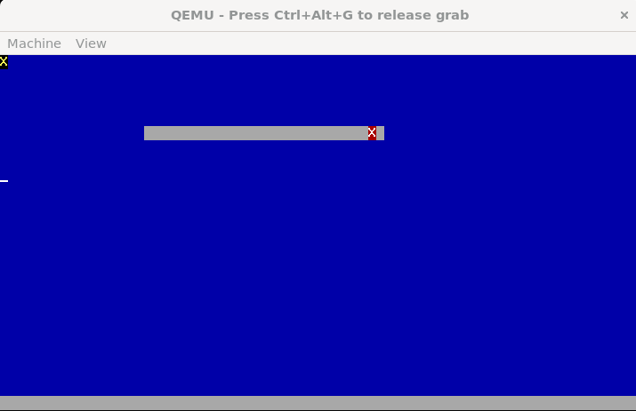

# 🚀 OBA-32: x86 İşletim Sistemi Çekirdeği

Kendi kendine öğrenme süreciyle geliştirilen, x86 (32-bit) mimarisini hedefleyen monolitik bir işletim sistemi çekirdeği.

OBA, x86 mimarisi üzerinde sıfırdan geliştirilen, eğitim ve ileri seviye kernel çalışmalarını hedefleyen bir mikro-çekirdek denemesidir.

## 🛠 Temel Özellikler
- **Özel Bootloader:** Assembly ile yazılmış düşük seviye başlangıç rutinleri.
- **Bellek Yönetimi:** Dinamik bellek genişletme ve fiziksel bellek yönetimi (PMM).
- **Sürücü Desteği:** Kesme (Interrupt) tabanlı Klavye ve Fare sürücüleri.
- **Grafik Arayüzü:** Temel VESA/VGA masaüstü prototipi.

  
   
  <i>Görsel 1: OBA v1.0.3 - İlk Masaüstü ve Pencere Yönetimi Denemesi</i>

---

---

## 🛠️ Teknik Özellikler
Proje şu anda temel sistem bileşenlerini ve donanım sürücülerini içermektedir:

* **Bootloader:** NASM ile yazılmış, Multiboot uyumlu `boot.s`.
* **Hafıza Yönetimi (Memory Management):** * `mm.c` ile dinamik bellek tahsisi (`kmalloc`).
    * Sayfalama (Paging) ve 128MB RAM desteği için Bitmap yönetimi.
* **Sürücüler (Drivers):**
    * **Klavye:** Kesme (Interrupt) tabanlı PS/2 klavye sürücüsü.
    * **Fare:** PS/2 fare desteği ve koordinat takibi.
* **Sistem Mimarisi:**
    * GDT (Global Descriptor Table) ve IDT (Interrupt Descriptor Table) yapılandırması.
    * Özel Linker Script (`linker.ld`) ile 1MB adres hizalaması.

## 📂 Dosya Yapısı
| Dosya | Açıklama |
| :--- | :--- |
| `kernel.c` | Ana kernel döngüsü ve sistem başlatma |
| `mm.c` | Bellek yönetimi ve kmalloc fonksiyonları |
| `keyboard.c` | Klavye tarama kodları (Scancodes) ve işleme |
| `mouse.c` | Fare verisi ayrıştırma ve imleç yönetimi |
| `Makefile` | Derleme ve QEMU çalıştırma otomasyonu |

## 🚀 Derleme ve Çalıştırma

Projeyi derlemek için sisteminizde `gcc`, `nasm` ve `ld` (i386-elf) bulunmalıdır.

1. **Derlemek için:**
   
   make

2. QEMU ile test etmek için:

    make run

Gelişim Süreci
Projenin adım adım gelişimini görmek için CHANGELOG.md dosyasına göz atabilirsiniz.

📜 Lisans
Bu proje Apache License 2.0 ile lisanslanmıştır. Detaylar için LICENSE dosyasına göz atabilirsiniz.
