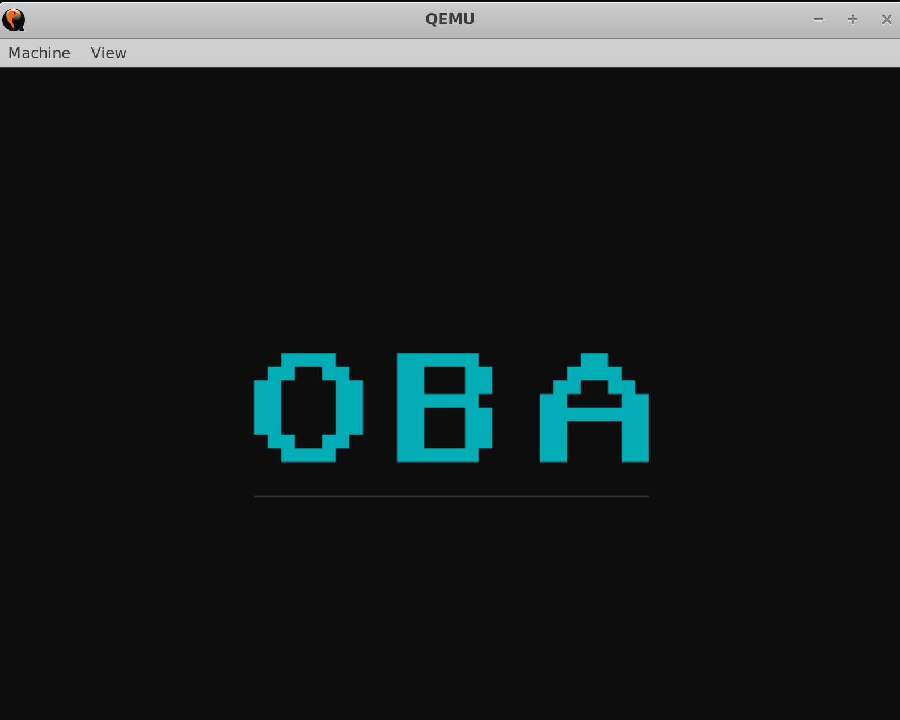

<p align="center">
  
  <br>
  <i>Görsel 1: OBA v1.0.4 - Grafik Masaüstü Arayüzü ve Gelişmiş Grafik Pencere Yönetimi</i>
</p>

---


https://github.com/user-attachments/assets/a7154d2a-ca60-45d1-b218-2f5982d759c7

<p align="center"><i>Video 1: OBA v1.0.5 - Fare Senkronizasyonu ve Canlı Pencere Sürükleme Demosu</i></p>

---

## 🛠️ Temel ve İleri Seviye Özellikler

OBA Çekirdeği, ilkel bir monolitik yapıdan ziyade nesne tabanlı (OOP in C) tasarım kalıplarını kullanarak aşağıdaki alt sistemleri barındırır:

* **Çoklu Görev Motoru (Round-Robin Scheduler):** Zamanlayıcı (PIT IRQ0) kesmesi ile çalışan, görevlerin CPU durumlarını (`EFLAGS`, `CS`, `EIP` ve genel amaçlı yazmaçlar) yiyinde (Stack) saklayıp değiştiren, `sleep` (uyuma) yeteneğine sahip kararlı çoklu görev motoru.
* **Identity Mapping & Kararlı Sayfalama (Paging):** İlk 4 MB'lık fiziksel bellek alanını (Kernel kodları, sistem yığını ve VGA video belleği dahil) birebir haritalayarak Page Fault ve hafıza taşması risklerini sıfırlayan sayfalama altyapısı. Çevrimsel çerçeve arabelleği (LFB) adresleri haritalandıktan sonra açılış logosu (splash screen) kararlı olarak belleğe işlenmektedir.
* **Çift Tamponlu Masaüstü Sunucusu (Double-Buffered GUI):** Donanımsal VBE/VGA sınırlamalarından bağımsız, tüm pencereleri ve bileşenleri önce RAM'deki `graphics_back_buffer` alanında işleyen ve ardından tek bir döngüde video belleğine fırlatarak ekran yırtılmalarını (flickering) önleyen pencere yöneticisi.
* **Yazı Tipi Motoru (VGA Bitmap Font Engine):** ISO/IEC 8859-1 standartlarında, 0-127 arasındaki tüm ASCII karakterlerini destekleyen eksiksiz 8x8 piksel yazı tipi matrisi. Sistem pencereleri, başlık barları ve kapatma butonları jilet gibi keskin yazı biçimleriyle render edilmektedir.
* **Akıllı Odaklanma ve Katman Önceliği (Z-Order Management):** Grafik pencerelerin sadece başlık çubuğuna değil, herhangi bir yüzey alanına tıklandığında ilgili pencereyi dinamik dizi hiyerarşisinde en sona taşıyarak otomatik olarak en üst katmana getiren (Focus) gelişmiş yönetim algoritması.
* **Sanal Dosya Sistemi (VFS Prototipi):** Dinamik bellekten yer tahsis ederek dosya oluşturma (`create_file`), dosya okuma (`read_file`) ve dizin listeleme yeteneklerine sahip RAM tabanlı temel dosya sistemi.
* **Gelişmiş Güç Yönetimi (ACPI / APM Shutdown):** Başlat menüsüne entegre edilen güç denetimi arayüzü vasıtasıyla, x86 mimarisinin I/O portlarına (`0x604`, `0xB004`) satır içi montaj (`inline assembly`) seviyesinde sinyal göndererek emülatör ve donanım gücünü kararlı şekilde kesen kapatma sistemi.
* **Senkronize Donanım Sürücüleri:**
  * **Klavye (PS/2 Keyboard & FIFO Buffer):** IRQ1 kesmelerini 256 baytlık dairesel bir FIFO (First-In, First-Out) kuyruğunda depolayan, veri kaybını önleyen sürücü. Bu kuyruk, TERMINAL penceresi ile senkronize edilerek gerçek zamanlı karakter girişini ve `Backspace`/`Enter` kontrol tuşlarını destekler.
  * **Fare (PS/2 Mouse):** Ham donanımsal piksel verilerini sanal bir uzayda biriktirip ekran çözünürlüğüne oranlayan, emülatör sınırlarından taşmayan ve tıklama/sürükleme (drag & drop) destekleyen IRQ12 sürücüsü. Sürücü kilitlenmelerini önlemek amacıyla kesmeler kapalıyken (`CLI` modunda) ilklendirilmektedir.

---

## 📂 Dosya Yapısı ve Mimarisi

OBA-32 çekirdek yapısı ve sürekli entegrasyon (CI/CD) alt yapısı aşağıda belirtilen dizin hiyerarşisine göre modüler olarak yapılandırılmıştır:

```text
OBA/
├── .github/            # GitHub sürekli entegrasyon (CI/CD) iş akışları ve otomasyon tanımları
├── assets/             # Dökümantasyon, ekran görüntüleri ve görsel medya bileşenleri
├── build/              # Derleme sürecinde üretilen ara nesne (.o) dosyalarının geçici dizini
├── include/            # Çekirdek alt sistemlerine ait makro ve fonksiyon prototip başlıkları (.h)
│   ├── fs.h            # Sanal dosya sistemi arabirimi veri yapıları
│   ├── gui.h           # Pencere yöneticisi ve yazı tipi motoru soyutlamaları
│   ├── hal.h           # Donanım Soyutlama Katmanı (I/O port rutinleri) makroları
│   ├── kernel.h        # Çekirdek global değişkenleri ve sistem çekirdek tanımları
│   ├── multiboot.h     # GRUB/Multiboot önyükleyici bilgi yapısı standartları
│   └── sched.h         # Görev denetim blokları (TCB) ve zamanlayıcı yapıları
├── src/                # Çekirdeğin yürütülebilir düşük seviyeli ve yüksek seviyeli kaynak kodları (.c / .s)
│   ├── boot.s          # Çekirdek giriş noktası, Multiboot başlığı ve kesme işaretçileri (stubs)
│   ├── fs.c            # RAM tabanlı dosya sistemi arama, yazma ve depolama rutinleri
│   ├── gdt.c           # Global Descriptor Table (GDT) segmentasyon haritalaması
│   ├── graphics.c      # Doğrusal çerçeve arabelleği (LFB) temel ilkel çizim fonksiyonları
│   ├── gui.c           # Çift tamponlu masaüstü, Z-Order hiyerarşisi ve ACPI güç kapatma kontrolü
│   ├── hal.c           # Donanım Soyutlama Katmanı (I/O port - inb/outb/outw) yürütmeleri
│   ├── idt.c           # Interrupt Descriptor Table (IDT) kesme vektör konfigürasyonları
│   ├── kernel.c        # Ana çekirdek döngüsü, zamanlayıcı emniyet kilidi ve ilklendirme sırası
│   ├── keyboard.c      # Dairesel FIFO arabellek yönetimi ve IRQ1 klavye kesme işleyicisi
│   ├── mm.c            # Fiziksel bellek yönetimi (PMM) ve Placement Allocator (kmalloc) motoru
│   ├── mouse.c         # CLI modunda zamanlama korumalı PS/2 fare sürücüsü ve koordinat filtresi
│   └── sched.c         # Çoklu görev denetimi, Round-Robin algoritması ve bağlam değişimi
├── .gitignore          # Git sürüm kontrol sisteminden muaf tutulacak kalıntıların listesi
├── .releaserc          # Otomatik sürüm yönetimi ve release konfigürasyon dosyası
├── CHANGELOG.md        # Çekirdek sürümleri arası yapılan değişikliklerin resmi geçmiş günlüğü
├── kernel.bin          # Bağlayıcı (Linker) tarafından üretilen freestanding ELF çekirdek imajı
├── LICENSE             # Apache License 2.0 yasal lisans metni
├── linker.ld           # Çekirdeği 1MB fiziksel adresine hizalayan bağlayıcı betiği
├── Makefile            # Çapraz derleme ve otomasyon süreçlerini yürüten inşa emirleri
├── oba.iso             # GRUB El Torito standardına göre üretilmiş önyüklenebilir CD-ROM kalıbı
├── package-lock.json   # Bağımlılık ağacının kilitlenmiş tam versiyon kayıtları
├── package.json        # Proje otomasyon araçları ve sürüm yönetimi npm paket tanımları
└── README.md           # Sistem mimarisi ve teknik dökümantasyon ana belgesi

##🚀 Derleme ve Çalıştırma
OBA çekirdeği, freestanding (bağımsız) modda derlenmekte olup herhangi bir standart C kütüphanesine (glibc) bağımlı değildir.

Gereksinimler
Sisteminizde nasm, gcc (32-bit desteği ile) ve qemu-system-i386 kurulu olmalıdır. Ubuntu/WSL üzerinde kurulum için:

Bash
sudo apt update
sudo apt install nasm gcc-multilib qemu-system-x86
Projeyi Derlemek
Derleme kalıntılarını temizlemek ve tüm alt sistemleri nesne dosyalarına (.o) dönüştürüp kernel.bin imajını bağlamak (link etmek) için:


1. **Derlemek için:**
   
   make

2. **QEMU ile test etmek için:**

    make run


📜 Lisans
Bu proje Apache License 2.0 ile lisanslanmıştır. Detaylar için LICENSE dosyasına göz atabilirsiniz.
